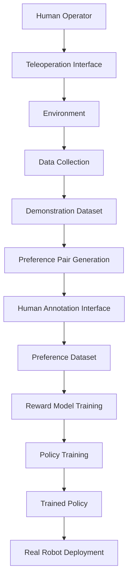

# Architecture Overview

This document describes the high-level architecture of Robo-RLHF-Multimodal.

## Core Components

### Data Collection Pipeline
```
Teleoperation → Data Collection → Preprocessing → Storage
```

**Components**:
- `collectors.TeleOpCollector`: Interface for various input devices
- `envs.MujocoManipulation`: Simulation environment wrapper
- Data serialization and storage utilities

### Preference Learning Pipeline  
```
Demonstrations → Pair Generation → Human Annotation → Preference Dataset
```

**Components**:
- `preference.PreferencePairGenerator`: Creates comparison pairs
- `preference.PreferenceServer`: Web interface for human feedback
- Preference aggregation and validation

### RLHF Training Pipeline
```
Preferences → Reward Model → Policy Training → Evaluation
```

**Components**:
- `models.RewardModel`: Learns from human preferences
- `models.VisionLanguageActor`: Multimodal policy network
- `algorithms.MultimodalRLHF`: Training orchestration

## Data Flow



## Module Structure

### `robo_rlhf/collectors/`
Handles data collection from various sources:
- Spacemouse, keyboard, VR controllers
- Synchronized multimodal recording
- Data validation and preprocessing

### `robo_rlhf/envs/`
Environment abstractions:
- MuJoCo task definitions
- Isaac Sim integrations
- Real robot interfaces via ROS2

### `robo_rlhf/models/`
Neural network architectures:
- Vision encoders (CLIP, ResNet, etc.)
- Proprioception encoders
- Actor and critic networks
- Reward models

### `robo_rlhf/algorithms/`
Training algorithms:
- RLHF implementation
- Distributed training utilities
- Hyperparameter optimization

### `robo_rlhf/preference/`
Human feedback collection:
- Web-based annotation interface
- Preference aggregation
- Quality control and validation

### `robo_rlhf/deployment/`
Real-world deployment:
- ROS2 integration
- Real-time policy execution
- Safety monitoring

## Design Principles

### Modularity
Each component is designed to be:
- Independently testable
- Configurable via parameters
- Extensible for new environments/models

### Multimodality
Support for multiple input modalities:
- RGB/depth images
- Proprioceptive state
- Force/torque sensors
- Audio (future)

### Scalability
Architecture supports:
- Distributed data collection
- Multi-GPU training
- Large-scale preference datasets
- Real-time deployment

### Safety
Built-in safety mechanisms:
- Input validation
- Model uncertainty estimation
- Emergency stop capabilities
- Graceful degradation

## Extension Points

### Custom Environments
```python
class CustomEnvironment(BaseEnvironment):
    def reset(self) -> Observation:
        pass
    
    def step(self, action: Action) -> Tuple[Observation, Reward, Done, Info]:
        pass
```

### Custom Models
```python
class CustomRewardModel(RewardModel):
    def forward(self, obs: Observation, action: Action) -> torch.Tensor:
        pass
```

### Custom Data Collection
```python
class CustomCollector(BaseCollector):
    def collect_episode(self) -> Episode:
        pass
```

This architecture enables rapid experimentation while maintaining production-ready deployment capabilities.