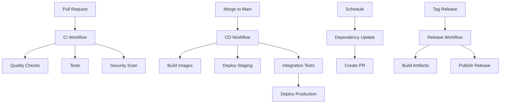

# GitHub Workflows Documentation

This directory contains comprehensive documentation and templates for GitHub Actions workflows that should be implemented for the Robo-RLHF-Multimodal project.

## Required Manual Setup

⚠️ **IMPORTANT**: Due to GitHub App permission limitations, the actual workflow files must be created manually by repository maintainers. This directory provides complete templates and documentation for implementation.

## Workflow Overview

The CI/CD pipeline consists of several automated workflows:

1. **[CI Workflow](ci.md)** - Continuous Integration (tests, quality checks)
2. **[CD Workflow](cd.md)** - Continuous Deployment (staging, production)
3. **[Security Workflow](security.md)** - Security scanning and vulnerability checks
4. **[Release Workflow](release.md)** - Automated releases and versioning
5. **[Dependency Management](dependency-update.md)** - Automated dependency updates

## Quick Setup Guide

### 1. Create Workflow Directory
```bash
mkdir -p .github/workflows
```

### 2. Copy Templates
Copy the workflow templates from `docs/workflows/examples/` to `.github/workflows/`:

```bash
# CI/CD workflows
cp docs/workflows/examples/ci.yml .github/workflows/
cp docs/workflows/examples/cd.yml .github/workflows/
cp docs/workflows/examples/security.yml .github/workflows/
cp docs/workflows/examples/release.yml .github/workflows/
cp docs/workflows/examples/dependency-update.yml .github/workflows/
```

### 3. Configure Secrets
Add the following secrets in GitHub repository settings:

- `CODECOV_TOKEN` - For code coverage reporting
- `DOCKER_REGISTRY_TOKEN` - For Docker image publishing
- `WANDB_API_KEY` - For ML experiment tracking
- `SLACK_WEBHOOK_URL` - For notifications
- `GPG_PRIVATE_KEY` - For signed releases

### 4. Set Up Branch Protection
Configure branch protection rules:
- Require PR reviews (minimum 2)
- Require status checks to pass
- Require branches to be up to date
- Restrict pushes to main branch

## Workflow Architecture



## Environment-Specific Configurations

### Development
- Fast feedback loops
- Unit and integration tests
- Code quality checks
- Security scanning

### Staging
- Full test suite execution
- Performance benchmarks
- End-to-end tests
- Database migrations

### Production
- Manual deployment approval
- Blue-green deployment
- Health checks and monitoring
- Automated rollback

## Performance Optimization

### Caching Strategy
- Python dependencies (`pip` cache)
- Docker layer caching
- Test artifacts
- Build outputs

### Parallel Execution
- Matrix builds for multiple Python versions
- Parallel test execution
- Concurrent quality checks

### Resource Optimization
- Use appropriate runner types
- Minimize workflow complexity
- Optimize Docker builds

## Monitoring and Observability

### Workflow Metrics
- Build success rates
- Test execution times
- Deployment frequency
- Lead time for changes

### Alerting
- Failed deployments
- Security vulnerabilities
- Performance regressions
- Long-running workflows

## Security Best Practices

### Secrets Management
- Use GitHub Secrets for sensitive data
- Rotate secrets regularly
- Limit secret access scope
- Use environment-specific secrets

### Access Control
- Minimize workflow permissions
- Use GITHUB_TOKEN when possible
- Implement least privilege principle
- Regular access reviews

### Vulnerability Management
- Automated dependency scanning
- Container image scanning
- Code security analysis
- Regular security updates

## Troubleshooting

### Common Issues

1. **Workflow Not Triggering**
   - Check workflow file syntax
   - Verify branch/path filters
   - Check repository permissions

2. **Test Failures**
   - Review test logs
   - Check environment differences
   - Verify dependency versions

3. **Deployment Issues**
   - Check deployment logs
   - Verify environment configuration
   - Check service health

4. **Permission Errors**
   - Review GITHUB_TOKEN permissions
   - Check secret access
   - Verify repository settings

### Debug Commands
```bash
# Local workflow testing with act
act -j test

# Validate workflow syntax
gh workflow view test.yml

# Check workflow runs
gh run list

# View workflow logs
gh run view <run-id>
```

## Compliance and Governance

### Required Checks
- [ ] All tests pass
- [ ] Code coverage > 80%
- [ ] Security scan clear
- [ ] Performance benchmarks pass
- [ ] Documentation updated

### Audit Trail
- All changes tracked in git
- Deployment history preserved
- Security scan results archived
- Compliance reports generated

## Continuous Improvement

### Metrics Collection
- Track workflow performance
- Monitor test reliability
- Measure deployment success
- Analyze failure patterns

### Optimization Opportunities
- Reduce workflow execution time
- Improve test reliability
- Enhance error reporting
- Streamline processes

## Support and Documentation

### Internal Resources
- [Development Guide](../DEVELOPMENT.md)
- [Testing Guide](../TESTING.md)
- [Deployment Guide](../deployment/README.md)
- [Monitoring Guide](../monitoring/README.md)

### External References
- [GitHub Actions Documentation](https://docs.github.com/en/actions)
- [Workflow Syntax](https://docs.github.com/en/actions/using-workflows/workflow-syntax-for-github-actions)
- [Security Hardening](https://docs.github.com/en/actions/security-guides/security-hardening-for-github-actions)

---

**Note**: These workflows are designed to be production-ready and follow GitHub Actions best practices. Customize as needed for your specific requirements.